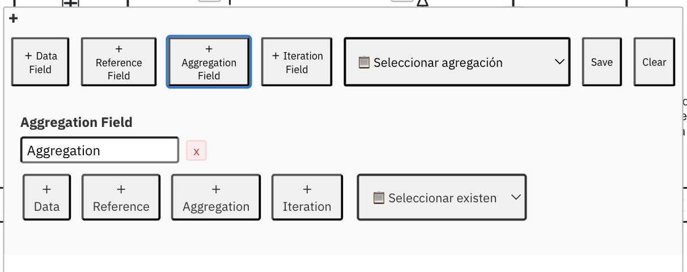

# 📝 BPMN Message Structure Plugin

[](https://camunda.com/download/modeler/) [](#) [](LICENSE)

> 🚀 A powerful Camunda Modeler plugin that allows you to define and persist message structures directly in your BPMN elements with automatic XML persistence.



## ✨ Features

- 📋 **Data Fields Management** - Add, edit, and organize data fields for BPMN elements
- 💾 **Automatic Persistence** - Data is automatically saved to the BPMN XML file
- 🔄 **Real-time Sync** - Changes are immediately reflected and persisted
- 📊 **JSON Export** - View and export your message structures as JSON
- 🎯 **Element-specific** - Each BPMN element can have its own message structure

## 🚀 Quick Start

### Installation

1. Download or clone this repository
2. Copy the plugin folder to your Camunda Modeler plugins directory:
   ```
   {CAMUNDA_MODELER_INSTALLATION}/resources/plugins/
   ```
3. Restart Camunda Modeler

### Usage

1. **Open a BPMN diagram** in Camunda Modeler
2. **Click on any BPMN element** (task, event, gateway, etc.)
3. **Look for the "+" icon** that appears near the element
4. **Click the "+" to expand** the message structure panel
5. **Add data fields** using the "+ Data Field" button
6. **Configure each field**:
   - **Identifier**: true/false
   - **Operation**: input, generation, derivation
   - **Domain**: text, number, money, date
   - **Value**: your custom value
7. **Click "Save"** to persist the data
8. **Save the file** (Ctrl+S) - your data will be permanently stored in the XML!

## 🛠️ Development

To modify or build the plugin:

```bash
npm install
npm run bundle
```

## 📄 License

MIT © [Your Name]

---

**💡 Tip**: Your message structures are automatically saved in the BPMN XML file, so they'll persist when you close and reopen Camunda Modeler!
# camunda-messageStructure-plugin
