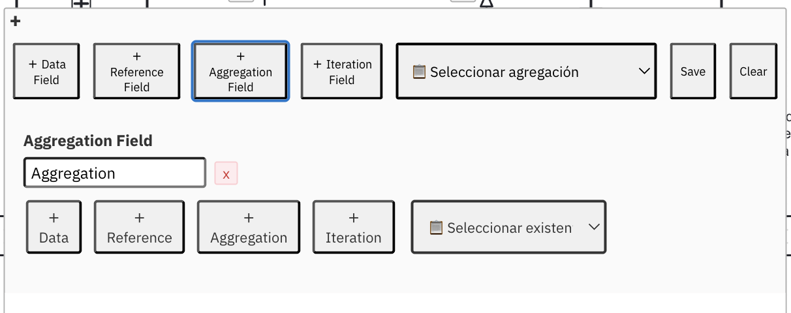

# 📝 BPMN Message Structure Plugin

[](https://camunda.com/download/modeler/) [](#) [](LICENSE)

> 🚀 A powerful Camunda Modeler plugin that allows you to define and persist message structures directly in your BPMN elements with automatic XML persistence.



## ✨ Features

- 📋 **Data Fields Management** - Add, edit, and organize data fields for BPMN elements
- 💾 **Automatic Persistence** - Data is automatically saved to the BPMN XML file
- 🔄 **Real-time Sync** - Changes are immediately reflected and persisted
- 📊 **JSON Export** - View and export your message structures as JSON
- 🎯 **Element-specific** - Each BPMN element can have its own message structure

## 🚀 Quick Start

### Installation

1. Download or clone this repository
2. Copy the plugin folder to your Camunda Modeler plugins directory:
   ```
   {CAMUNDA_MODELER_INSTALLATION}/resources/plugins/
   ```
3. Restart Camunda Modeler

### Configuration

#### Configurar API Key de Gemini

Este plugin utiliza Google Gemini AI para generar diagramas UML. Para usarlo, necesitas configurar tu API key de forma segura:

**Opción 1: Archivo `config.json` (Recomendado)**

1.  **Crea un archivo llamado `config.json`** en la raíz de la carpeta del plugin (al mismo nivel que `package.json`).
2.  Añade el siguiente contenido al archivo:

    ```json
    {
      "GEMINI_API_KEY": "tu-api-key-aqui"
    }
    ```

3.  **Reemplaza `"tu-api-key-aqui"`** con tu API key real de Google AI Studio.

    **⚠️ Importante:** Asegúrate de que el archivo `config.json` esté en tu `.gitignore` (ya debería estarlo para evitar subirlo accidentalmente). Este método es el más confiable para Camunda Modeler.

**Opción 2: Variable de entorno (Alternativa - puede tener problemas en Electron)**

Configura la variable de entorno `GEMINI_API_KEY` antes de ejecutar Camunda Modeler (este método puede ser menos fiable en Electron):

**En macOS/Linux:**
```bash
export GEMINI_API_KEY="tu-api-key-aqui"
# Luego ejecuta Camunda Modeler desde la misma terminal
```

**En Windows (PowerShell):**
```powershell
$env:GEMINI_API_KEY="tu-api-key-aqui"
# Luego ejecuta Camunda Modeler desde la misma sesión
```

**En Windows (CMD):**
```cmd
set GEMINI_API_KEY=tu-api-key-aqui
# Luego ejecuta Camunda Modeler desde la misma sesión
```

**Para obtener una API key:**
1.  Visita [Google AI Studio](https://aistudio.google.com/app/apikey)
2.  Crea una nueva API key
3.  Cópiala y configúrala usando una de las opciones anteriores.

### Usage

1. **Open a BPMN diagram** in Camunda Modeler
2. **Click on any BPMN element** (task, event, gateway, etc.)
3. **Look for the "+" icon** that appears near the element
4. **Click the "+" to expand** the message structure panel
5. **Add data fields** using the "+ Data Field" button
6. **Configure each field**:
   - **Identifier**: true/false
   - **Operation**: input, generation, derivation
   - **Domain**: text, number, money, date
   - **Value**: your custom value
7. **Click "Save"** to persist the data
8. **Save the file** (Ctrl+S) - your data will be permanently stored in the XML!

## 🛠️ Development

To modify or build the plugin:

```bash
npm install
npm run bundle
```

## 📄 License

MIT © Diego Aliaga

# camunda-messageStructure-plugin
